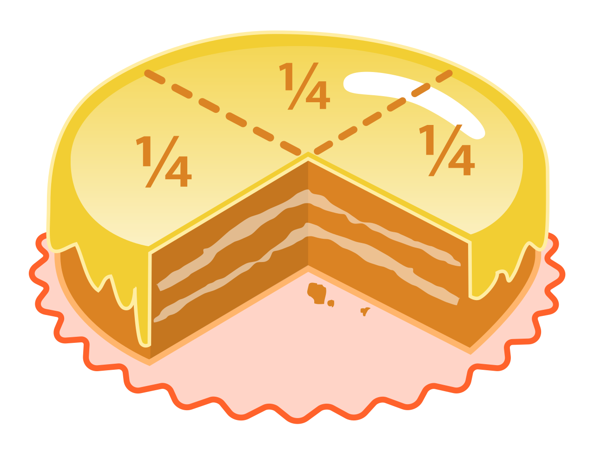
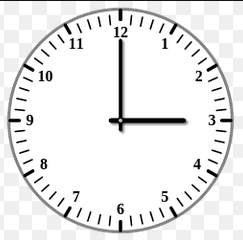

==============================
Обыкновенные дроби
==============================

Зачем нужны обыкновенные дроби?
-------------------------------
Например, представим, что у вас день рождения, и к вам пришли 4 друзей. Разделив торт среди них всех поровну, каждый получит *"одну пятую торта"* – :math:`\frac{1}{4}`. Вот вам и дроби в повседневной жизни :)

А вообще, это **важная математическая абстракция**.

Определение
-----------

**Обыкновенная дробь** (*англ. Ordinary fractions*) – это выражения вида :math:`\Large \frac{m}{n}`, где :math:`m` и :math:`n` – **натуральные числа**. 

То есть, выражаясь математическим языком: :math:`m, n \in \mathbb{N}`.

.. note::
    Символ :math:`\Large \in` – обозначает принадлежность к какому-то множеству. 

    Например, утверждение *"Все кошки (К) есть животные (Ж)"* с помощью математической записи можно запистаь так: :math:`К \in Ж` – "**Кошки**" являются элементом множества "**Животные**".

Где :math:`\Large \frac{m}{n} = \frac{числитель}{знаменатель}`

перед (над) чертой называется числителем, а число после черты (под чертой) — знаменателем. Первый играет роль делимого, второй — делителя.

Обыкновенные дроби с целыми числителями и знаменателями образуют поле рациональных чисел. 

**Пример использования обыкновенной дроби:**

Допустим, сейчас 3 часа ночи. Какая часть суток прошла? 

В сутках 24 часа, а прошло 3 часа из этих 24, то получается *"три двадцатьчетвёртых"* – :math:`\Large \frac{3}{24}`. А если сократить эту дробь на **3**, то получим *"одну восьмую"* – :math:`\Large \frac{1}{8}`. Прошла :math:`\Large \frac{1}{8}` суток.

Типы дробей
-----------
Обыкновенные дроби бывают нескольких видов:

1. Правильные
    * :math:`числитель < знаменатель`.
    * Например числа: :math:`\frac{1}{2}, \frac{3}{4}, \frac{1}{8}` и так далее.
2. Неправильные
    * :math:`числитель > знаменатель`
    * Например числа: :math:`\frac{10}{9}, \frac{5}{3}, \frac{14}{3}` и так далее.
3. Смешанные
    * Дроби вида :math:`a + \frac{b}{c}` называют **смешанными**. То есть здесь **выделяется целая часть**.
        * *Пример:* :math:`1 + \frac{1}{9}`.
    * Как правило, в записи этих чисел знак "+" опускают и пишут :math:`a\frac{b}{c}`.
        * *Пример:* :math:`1\frac{1}{9}`.
    * Всякую смешанную дробь можно представить в виде обыкновенной: :math:`a + \frac{b}{c} = \frac{ac + b}{c}`.
        * *Пример:* :math:`1 + \frac{1}{9} = \frac{1 \cdot 9 + 1}{9} = \frac{10}{9}`.
    * Например числа: :math:`1\frac{1}{9}, 7\frac{3}{4}` и так далее.

Основное свойство дроби
-----------------------

**При умножении или делении числителя и знаменателя на одно и то же число – значение дроби не меняется.**

.. math::
    \Large
    \frac{a}{b} = \frac{a \cdot c}{b \cdot c}

.. raw:: html

      

Сложение и вычитание дробей
---------------------------

С одинаковыми знаменателями
~~~~~~~~~~~~~~~~~~~~~~~~~~~
Если дроби имеют одинаковый знаменатель, то суммой/разностью этих дробей будет дробь, числитель которой равен сумме/разности числителей исходных дробей, а знаменатель равен исходному знаменателю.

.. math::
    \Large
    \frac{a}{c} \pm \frac{b}{c} = \frac{a \pm b}{c}

.. note::

    **Пример вычитания дробей.** Найдите значение выражения: :math:`\large 4\frac{2}{3} - \frac{5}{3}`

    *Решение:*

    1. Сначала представим в виде неправильной дроби дробь: :math:`\large 4\frac{2}{3}`
        * :math:`\large 4\frac{2}{3} = \frac{4 \cdot 3 + 2}{3} = \frac{14}{3}`
    2. Теперь можем вычесть из одной дроби другую:
        * :math:`\large 4 \frac{2}{3} - \frac{5} {3} = \frac{14} {3} - \frac{5} {3} = \frac{9} {3} = 3`
    3. Ответ: :math:`\large 3`

С разными знаменателями
~~~~~~~~~~~~~~~~~~~~~~~
Если дроби имеют разные знаменатели, то **сначала нужно воспользоваться** `основным свойством дробей <#id5>`_ **и привести их к общему знаменателю, а потом просто воспользоваться правилом сложения/вычитания дробей**.

.. math::
    \Large
    \frac{a}{c} \pm \frac{b}{d} = \frac{a \cdot d \pm b \cdot c}{c \cdot d}

.. note::

    **Пример сложения дробей.** Сложите дроби: :math:`\frac{2}{5} + \frac{3}{4}​`

    *Решение:*

    1. Нам даны дроби с разными знаменателями, поэтому сначала приведем их к общему знаменателю.
        * :math:`\large \frac{2}{5} = \frac{2 \cdot 4}{5 \cdot 4} = \frac{8}{20}`
        * :math:`\large \frac{3}{4} = \frac{3 \cdot 5}{4 \cdot 5} = \frac{15}{20}`
    2. Теперь, когда мы получили дроби с одинаковыми знаменателями, можем сложить их:
        * :math:`\large \frac{2}{5} + \frac{3}{4} = \frac{8}{20} + \frac{15}{20} = 1\frac{3}{20}`
    3. Ответ: :math:`\large 1\frac{3}{20}`

.. attention::
    При сложении и вычитании смешанных чисел, можно отдельно сложить (вычесть) целые и дробные их части. Например, :math:`\large 2\frac{1}{6}+5\frac{5}{12}=(2+5)+\frac{2+5}{12}=7\frac{7}{12}`

Умножение и деление дробей
--------------------------

Умножение
~~~~~~~~~
*Произведение* двух обыкновенных дробей есть **дробь, числитель которой равен произведению числителей исходных дробей, а знаменатель произведению знаменателей исходных дробей.**

.. math::
    \Large
    \frac{a}{b} \cdot \frac{c}{d} = \frac{a \cdot c}{b \cdot d}

.. note::

    **Пример умножения дробей.** Вычислим: :math:`\frac{3}{5} \cdot 2\frac{1}{4}​`

    *Решение:*

    1. Сначала представим дробь :math:`\large 2\frac{1}{4}` в виде неправильной:
        * :math:`\large 2\frac{1}{4} = \frac{9}{4}`
    2. Теперь перемножим одну дробь на другую:
        * :math:`\large \frac{3}{5} \cdot \frac{9}{4}​ = \frac{3 \cdot 9}{5 \cdot 4} = \frac{27}{20}`
    3. Выделим целую часть, если того требует задание:
        * :math:`\large \frac{27}{20} = 1\frac{7}{20}`
    4. Ответ:
        * :math:`\large 1\frac{7}{20}`

Деление
~~~~~~~
*Частное* двух обыкновенных дробей равно **произведению первой дроби на перевёрнутую вторую дробь.**

.. math::
    \Large
    \frac{a}{b} : \frac{c}{d} = \frac{a \cdot d}{b \cdot c}

.. attention::

    При умножении и делении смешанных чисел необходимо представлять эти числа в виде обыкновенных дробей!

Прочие свойства
~~~~~~~~~~~~~~~

    * Дроби :math:`\large \frac{a}{b} и \frac{b}{a}` являются *взаимно обратными*. **Произведение взаимно обратных дробей равно единице:** :math:`\large \frac{a}{b} \cdot \frac{b}{a} = 1`

Основные формулы
----------------
1. Сложение/вычитание дробей:
    * :math:`\Large \frac{a}{c} \pm \frac{b}{c} = \frac{a \pm b}{c}`
    * :math:`\Large \frac{a}{c} \pm \frac{b}{d} = \frac{a \cdot d \pm b \cdot c}{c \cdot d}`
2. Умножение/деление дробей:
    * :math:`\Large \frac{a}{c} \pm \frac{b}{d} = \frac{a \cdot d \pm b \cdot c}{c \cdot d}`
    * :math:`\Large \frac{a}{b} : \frac{c}{d} = \frac{a \cdot d}{b \cdot c}`
3. Взаимная обратность:
    * :math:`\Large \frac{a}{b} \cdot \frac{b}{a} = 1`