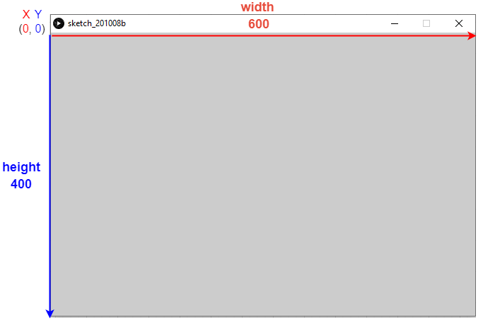
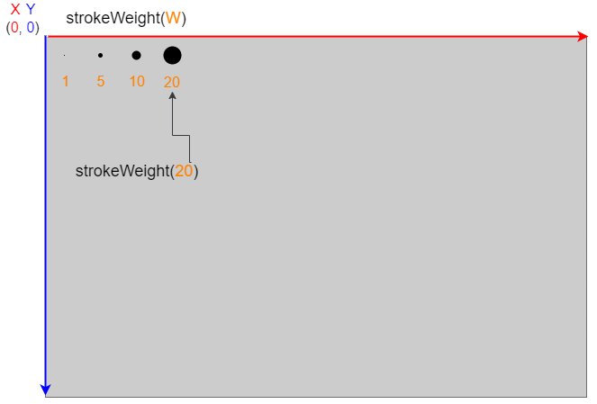

Команды Processing
==================

Базовые команды
---------------
Настройка
"""""""""
size(width, height)
*******************
``size(width, height)`` - задаёт размер окна по ширине (width) и высоте (height).

Например, ``size(600, 400)``. Создаст окно - 600 пикселей в ширину и 400 в высоту.

    Пример исполнения функции size(600, 400)

.. raw:: html

    

``strokeWeight(weight)`` - задаёт толщину "штриха" (линий и точек).

Например, ``strokeWeight(10)``. Задаст ширину "штриха" - 10 пикселей.

    Пример исполнения функции strokeWeight() с разными параметрами

.. raw:: html

    

``stroke(colorGrey)`` - установить цвет "штриха" на оттенок серого (от 0 до 255).

``stroke(Red, Green, Blue)`` - установить цвет "штриха" в формате RGB - Red, Green, Blue (Красный, зелёный, синий).

Например, ``stroke(125)``. Задаст цвет "штриха" - светло серый.

``stroke(255, 100, 0)``. Задаст цвет "штриха" - оранжевый.

.. raw:: html

    

``fill(colorGrey)`` - установить цвет заливки фигуры на оттенок серого (от 0 до 255).

``fill(Red, Green, Blue)`` - установить цвет фигуры в формате RGB - Red, Green, Blue.

Например, ``fill(125)``. Задаст цвет фигуры - светло серый.

``fill(0, 100, 255)``. Задаст цвет фигуры - голубой.

.. raw:: html

    

Фигуры
""""""
``point(x, y)`` - нарисовать точку в координатах (x, y).

Например, ``point(20,40)``. Нарисовать точку на расстоянии 20 от левого края (x=20) и 40 от верхнего (y=40).

.. raw:: html

    

``line(x1, y1, x2, y2)`` - нарисовать линию, у которой точка начала по координатам (x1, y1), а точка конца (x2, y2).

Например, ``line(0, 0, 100, 100)``. Нарисовать линию из точки-начала (0, 0) в точку-конец (100, 100).

.. raw:: html

    

``rect(x, y, width, height)`` - нарисовать прямоугольник, в координате (x, y) с указанной шириной (width) и высотой (height). 

Например, ``rect(20, 40, 150, 100)``. Нарисовать прямоугольник в точке (20, 40) с шириной 150 и высотой 100.

.. raw:: html

    

``ellipse(x, y, width, height)`` - нарисовать элипс (круг), в координате (x, y) с указанной шириной (width) и высотой (height). 

Например, ``ellipse(50, 50, 30, 30)``. Нарисовать элипс в точке (50, 50) с шириной 30 и высотой 30.

.. raw:: html

    

``triangle(x1, y1, x2, y2, x3, y3)`` - нарисовать треугольник, вершины которого будут в (x1, y1), (x2, y2), (x3, y3) координатах. 

Например, ``triangle(40, 100, 60, 20, 150, 100)``. Нарисовать треугольник с вершинами (40, 100), (60, 20), (150, 100).

.. raw:: html

    
