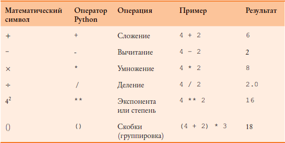

====================================
Операторы, типы данных и переменные
====================================

.. contents:: Содержание
    :depth: 2

Мы использовали язык Python для создания интересных программ, рисующих картинки за счет всего нескольких строк кода, но наши программы были ограничены в возможностях. Мы просто запускали их и наблюдали, как они сами создают картинки. 

А что если бы мы захотели взаимодействовать с нашими программами на Python? На этом занятии мы узнаем, как заставить Python запросить имя пользователя, а также попробуем применение операторов при рисовании картин, на один большой шаг приблизившись к созданию динамических анимаций!

Переменные: место, где мы храним данные
---------------------------------------

В предыдущем уроке, мы использовали переменную ``name`` для записи в неё имени "Вася". Теперь давайте посмотрим, что такое в действительности переменные и как они работают.

Переменная
""""""""""
*Переменная* — это нечто такое, что нужно запомнить вашему ком-ьютеру на время работы программы.

Когда Python «запоминает» что-либо, он сохраняет эту информацию в памяти компьютера. Python может запоминать значения нескольких *типов данных*, например числовые значения (такие как *7*, *42* или даже дробные числа, вроде *3.1415*) и строки (буквы, символы, слова, предложения — все, что вы можете набрать на клавиатуре). А также и *пользовательские* типы данных, но это уже забегая далеко вперёд.

В Python, как и в большинстве других современных языков программирования, мы *присваиваем* значение переменной с помощью знака равенства (``=``).

Например, в примере с именем "Вася" мы сделали это вот так:

.. code-block:: python

    name = "Вася"

Если мы присваиваем *строку*, то нужно не забыть взять её в кавычки (``""``)!

Также мы можем присваивать переменным и другие *типы данных*. Например, числа:

.. code-block:: python

    x = 42
    y = 15
    PI = 3.1415

Если это число, то кавычки (``""``) не нужны. Если мы возмём в кавычки, например ``"3.1415"``, то это уже будет не *число*, а *строка*!

.. note::
    **Как Python различает типы данных?**

    Python - язык с *динамичекой типизацией*. Это означает, что он может сам, то есть без указания программиста, *динамически* адаптировать те или иные переменные к нужному типу данных. То есть, например, если мы сначала запишем в переменную число ``var = 42``, то ничто нам не помешает потом записать в неё строку ``var = "Hello"`` - Python всё сделает!

Имена переменных
""""""""""""""""
Каждый раз при присвоении переменной какого-либо значения сначала (слева от знака равенства) необходимо указать имя этой переменной (чтобы мы могли к ней потом обращаться), а затем (справа от знака равенства) — присваиваемое значение.

Как правило, переменные называются простыми именами, описывающими содержащееся в переменной значение (как в случае с переменной ``name``, хранящей имя). 

Такой подход упрощает понимание предназначения переменных и их последующее использование. Однако следует запомнить несколько правил, которым должны соответствовать имена создаваемых переменных.

#. Используевые буквы должны быть латинскими.
#. Остальные символы в имени переменной должны быть *буквами, цифрами или нижним подчеркиванием (``_``)*. Внутри имени переменной пробелы не допускаются (например, имя `my name` приведет к появлению сообщения о синтаксической ошибке, так как Python подумает, что вы перечислили две пе ременные и разделили их пробелом).
#. Имена переменных в Python чувствительны к регистру (БОЛЬШИЕ или маленькие буквы). Это значит, что если в имени переменной мы использовали только буквы нижнего регистра (например, ``abc``), то воспользоваться значением, сохраненном в переменной, мы можем, только указав имя переменной в точно таком же виде, в том же регистре. Таким образом, переменная ``My_Name`` отличается от ``my_name``, а ``MY_NAME`` от них обеих.

Использование переменных
""""""""""""""""""""""""
Использовать переменные очень легко! Как присвоить (записать) значение переменной ты уже знаешь. А чтобы использовать её, то есть обратиться к тому значению, что в нём находится - нужно просто использовать её имя.

Например, как в программе приветствия Васи.

.. code-block:: python

    name = "Вася"
    print("Привет", name)

``print("Привет", name)`` - здесь мы ввели строку ``"Привет"`` вместе с тем, что хранилось в ``name``.

Чтобы лучше понять этот механизм - запусти *интерпретатор Python* и попробуй создать свои переменные и взять из них значения.

Например, 

.. code-block:: python

    >>> num = 42
    >>> num
    >>> 42
    >>> hi = "hello"
    >>> hi
    >>> hello

Пользовательский ввод
"""""""""""""""""""""
Чтобы улучшить нашу программу, можно сделать так, чтобы в переменную сохранялось то значение, которое введёт пользователь.

Выглядеть это будет так:

.. code-block:: python

    name = input("Введите своё имя: ")
    print("Привет", name)

.. note::
    ``name = input("Введите своё имя: ")`` — создаём переменную ``name`` и записываем в неё результат выполнения команды (функции) ``input``, а в скобочках к команде ``()`` передаём то, какую строку вывести в консоль при запросе.

    ``print("Привет", name)`` — вывести в консоль "Привет" вместе с ``name``, вставив между ними пробел.

Подводя итог:

* Переменные нужны, чтобы запоминать фрагменты данных, используемых в программе.
* Использовать в имени переменной мы можем только латинские буквы, цифры, знак подчёркивания (``_``) и имя должно начинаться с буквы.
* Python может *динамически* адаптировать те или иные переменные для нужного *типа данных*.

Числа и математика
-------------------

Компьютеры очень хороши в математических операциях (сложение, вычитание и так далее). Ваш компьютер способен совершать более одного миллиарда (1'000'000'000, или тысячи миллионов) математических операций в секунду!

Язык Python дает нам доступ к этому мощному ресурсу математических вычислений, предоставляя для этого числа двух основных видов:

* Целые числа. Например, *1, 2, 42, 1234* и тд.
* Вещественные (дробные) числа. Например, *1.5, 3.1415, 2.67842356* и тд. Их ещё называют *числа с плавающей точкой*

Но чтобы от чисел было больше пользы, мы должны уметь ими совершать с ними *операции*. И здесь Python предоставляет нам множество возможностей!

Операторы
----------
Оператор — это символ, или несколько символов — в отличие от имени переменной или функции (команды). Например, «+» умеет брать два числа слева и справа от себя(они называются операнды), складывать и подставлять вместо себя и операндов то, что получается.

Математические символы, такие как + (плюс) и − (минус), являются операторами, так как они оперируют (или выполняют вычисления) числами в уравнении. Когда мы говорим вслух «4 + 2», чтобы ввести это на калькуляторе, мы хотим сложить числа 4 и 2, чтобы получить их сумму, 6.

В языке Python используется большинство операторов, которыми вы пользуетесь на уроках математики, в том числе +, -, скобки () и другие, которые показаны в таблице ниже.

Задания
--------

Ну, самое время попробовать это всё в деле! Далее будут задания, с помощью которых ты сможешь опробовать и закрепить полученные знания.

Processing
""""""""""

#. Напиши код, который объяснит Processing, как нарисовать дом с крышей, окном и дверью. Можешь добавить больше деталей: печную трубу, траву, облака — выбор не ограничен. Не забудь раскрасить! Чтобы было легче позиционировать объекты, используй переменные и операторы.
#. По желанию, можешь попробовать изобразить более сложные или перейти к другим заданиям.

Стандартный Python 
""""""""""""""""""

Чепуха
******
Вместо того чтобы спрашивать имя пользователя, мы попросим ввести *прилагательное*, *существительное* и *глагол прошедшего времени мужского рода единственного числа* и сохраним введенные данные в трех разных переменных точно так же, как мы поступали с переменной ``name`` в исходной программе. Потом мы выведем на печать какое-нибудь предложение, например «Этот ``прилагательное существительное глагол`` на ленивую рыжую собаку».

Результат работы программы должен выглядеть примерно следующим образом:

.. code-block:: python

    >>>
    Введите прилагательное: умный
    Введите существительное: учитель
    Введите глагол прошедшего времени: чихнул
    Этот умный учительно чихнул на ленивую рыжую собаку.
    >>>

Попробуй придумать ещё что-нибудь забавное ;)

**И не забудь сохранить свою программу!**

Новая чепуха!
*************
Давайте сделаем нашу игру чуть более интересной. 

1. Создай новый файл для кода, сохрани под тем именем, которое тебе больше понравится.
2. Добавьте строку, которая бы запрашивала ввод названия животного с предлогом «на».
3. Затем измени команду ``print()``, убрав слово ``собаку`` и добавив переменную ``animal`` после предложения, взятого в кавычки (не забудь в команде ``print()`` добавить запятую перед новой переменной).

При желании вы можете изменить предложение
еще сильнее. К примеру, ``Эта весёлая меловая доска рыгнула на ленивого коричневого геккона!``, или что-нибудь еще более
забавное!

**И не забудь сохранить свою программу!**

Пиццерия
*********
Давайте представим, что мы не только программисты, но и владельцы нашей собственной пиццерии. 

Чтобы нам было удобно расчитывать общую стоимость заказа, с учетом налога, напишем небольшую программу, которая подсчитает это. 

Предположим, что у нас заказывают одну или несколько пицц одинаковой стоимости, а налог в нашей стране составляет 8% с общей стоимости покупки. То есть за каждый рубль, уплаченный за пиццу, мы должны заплатить восемь копеек налога с продаж. На словах мы можем смоделировать данную программу следующим образом:

#. Спросить человека, сколько пицц он желает заказать.
#. Запросить стоимость каждой пиццы, указанную в меню.
#. Подсчитать стоимость каждой пиццы как подытог.
#. Подсчитать начисляемый налог с продаж по ставке 8 процентов от подытога.
#. Добавить сумму налога с продаж к подытогу и получить итоговую стоимость.
#. Показать пользователю общую сумму к оплате, в том числе налог.

Рефлексия
---------

А теперь, давай подумаем над тем, как прошло занятие, что ты узнал нового, какие были трудности и что можно было бы сделать лучше. 

Переходи по ссылке и заполни форму - `рефлексия <https://forms.gle/XxGkE4bkVBcg47Uv5>`_.