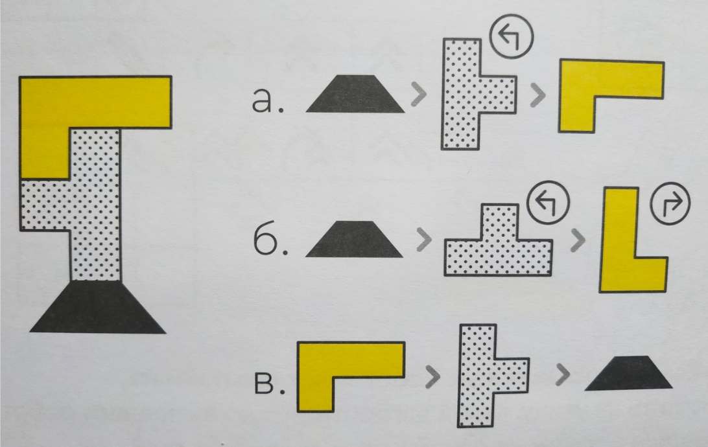
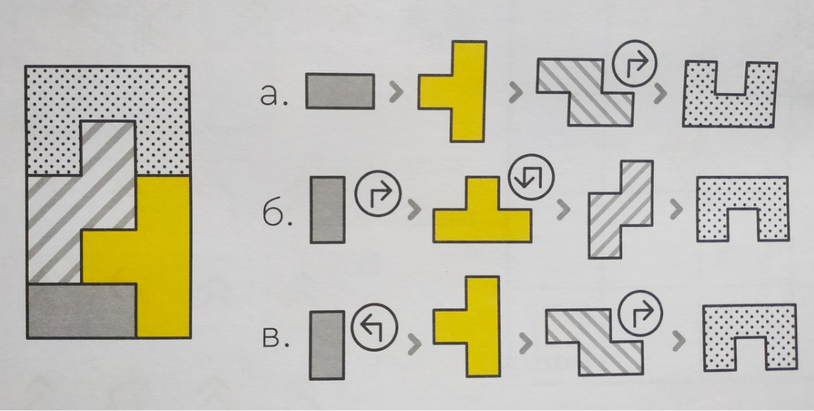
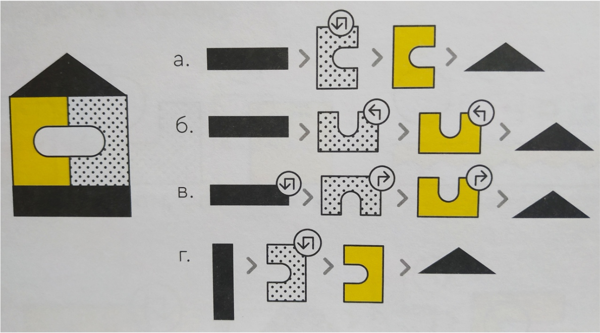
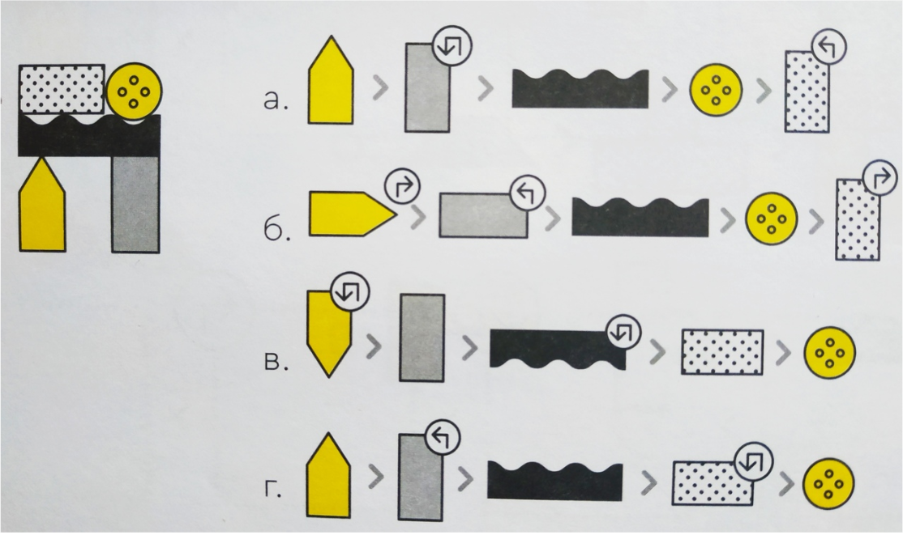
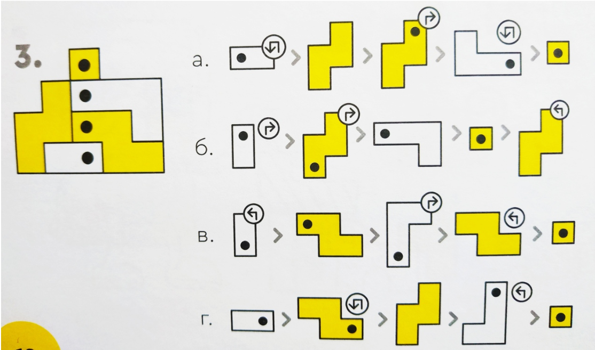
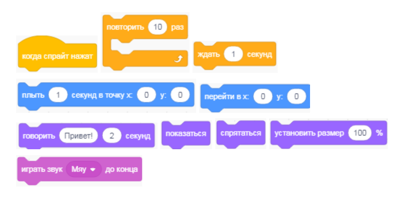

10 блоков
=========

Сегодня, мы продолжим погружение в программирование вместе с Scratch и попробуем сделать интересный и весёлый проект с помощью 10 блоков!

Но для начала, давай поиграем в игру, чтобы разогреть свои прекрасные и умные мозги. Ведь они нам очень понадобятся!

Игра "Действуй по алгоритму"
----------------------------
Робот должен построить башню по проекту. Есть команды для управления роботом: 

* поворот направо на 90 градусов
* поворот налево на 90 градусов
* поворот на 180 градусов. 

Команды над кубиками показывают, как их нужно повернуть перед тем, как построить башню.

Выбери алгоритм, с помощью которого получится построить башню как на рисунке слева. Какой из алгоритмов составлен верно? Ответы можешь записать в тетрадке или просто на листочке, чтобы потом разобрать их вместе с учителем.

Ну как? Мозги заряжены и готовы к работе! :)

Задание "10 блоков"
-------------------
Попробуй сделать проект используя только эти 10 блоков Скретч. 

Применяйте их один, два или более раз, но используйте каждый блок хотя бы раз.

Идеи для воплощения
-------------------

Прятки
******

* Создай спрайт с человеком, который ищет кота. Этот спрайт плавно перемещается в центр экрана и зовет кота (видим надпись на экране “Ты где?) слышится звук “Мяу” (3 раза). 
* Создай спрайт Кот в центре экрана, который уменьшается когда на него нажмут и исчезает в кустах.
* Используй все 10 новых блоков.

День рождения Котика
********************

* Создай спрайт Котика, который медленно перемещается в центр экрана и входит в комнату с шарами  (фон шары), звучит музыка, кот от восхищения говорит “Мяу” (видим надпись на экране).
* Создай спрайт Шарик, при нажатии на который он взлетает наверх и уменьшается в размерах, затем исчезает.
* Используй все 10 новых блоков.

Исследование космоса
********************

* Создай спрайт Космонавт, который проводит исследования в космосе (подбери космический фон) и плавно перемещается по станции. Вдруг появляется надпись “Замените баллон”.
* Создай спрайт Инопланетянин, при нажатии на который он начинает увеличиваться, приближается и приветствует Космонавта на инопланетном языке.
* Используй все 10 новых блоков.

Творческое задание
******************

* Придумай два спрайта и историю, в которой будут использованы все 10 новых блоков не менее 1 раза. Поделись своей идеей с соседом и спроси его идею.
* Используй все 10 новых блоков.

Если захочешь зарядиться новыми идеями и посмотреть, как с этим заданием справлялись другие (сможешь сделать лучше и интереснее?) переходи по ссылке - `тыкай колёсиком мыши! <https://scratch.mit.edu/studios/475480/>`

**Попробуй сделать ремикс какого-нибудь проекта!**

Рефлексия
---------

А теперь, давай подумаем над тем, как прошло занятие, что ты узнал нового, какие были трудности и что можно было бы сделать лучше. 

Переходи по ссылке и заполни форму - `рефлексия <https://forms.gle/XxGkE4bkVBcg47Uv5>`_.