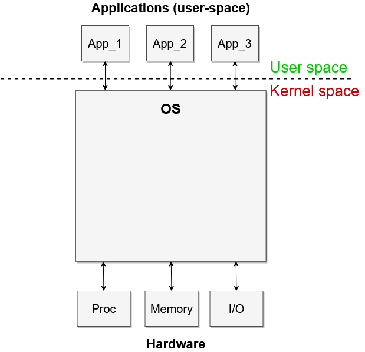
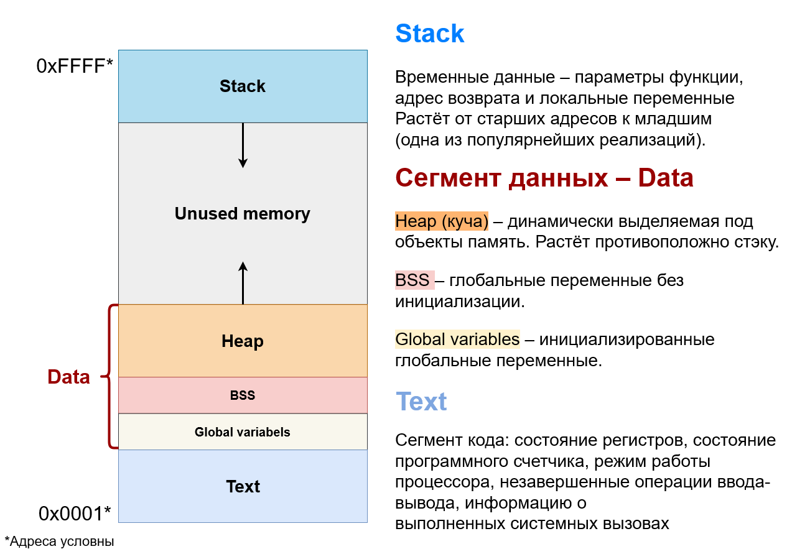

======================================================
Что такое операционная система и как она работает?
======================================================

.. note::
    Основа конспекта, лекция - `Что такое операционная система и как она работает <https://www.youtube.com/watch?v=hb9CTGSJm88&list=PLlb7e2G7aSpRgsZVTYYbpqiFrIcIpf8kp>`_
    Автор конспекта/статьи немного переработал и дополнил некоторые моменты: структуру и повествование, постарался дать более глубокое и последовательное разъясление, добавил как скаченные, так и созданные им лично схемы.

Цель конспекта — последовательно рассмотреть и объяснить принципы устройства и функционирования операционной системы, её основных компонентов и абстракций.

--------

.. contents:: Содержание
    :depth: 3

--------

Введение
----------------

Операционные системы окружают нас повсюду – это основное программное обеспечение персональных компьютеров, серверов, мобильных устройств, сетевых устройств (роутеры, коммутаторы) и даже современных автомобилей (борт-компьютер), телевизоров и прочего. Перечислять можно очень долго, ведь они требуются практически в каждой компьютерной системе.

Любой компьютер представляет собой **связанную совокупность: процессора, памяти и устройств ввода-вывода**.

.. figure:: _static/OS/basic_architecture.png
       :scale: 50 %
       :align: center
       :alt: Рис. 1. Общее представление архитектуры компьютера

       Рис. 1. Общее представление архитектуры компьютера

       `Более подробная структура архитектуры ПК <_static/OS/Motherboard_diagram_ru.jpg>`_

Сама по себе, аппаратура умеет делать только очень простые, базовые операции - по типу: *сложить два числа, перейти к адресу, записать по адресу и тд.*

Например, **процессор** умеет выполнять только три базовых типа инструкции:

    * Чтение инструкций/данных из памяти (read)
    * Выполнение интрукции (execute)
    * Запись результата в память (write)

Получается, что непосредственное **создание и управление** сложными процессами (приложениями) на аппаратуре становится крайне неэффективным и неудобным. То есть, например, создать и запустить на исполнение программу-браузер исключительно с помощью данных инструкций становится крайне сложной задачей. Особенно при условии, что помимо этого процесса (браузера) существуют и другие процессы, которые также пользуются ресурсами вычислительной машины.

Возникает вопрос — *Как заставить всё это слаженно и эффективно работать, сделав пользование компьютером удобным как для обычного человека, так и для прикладного программиста?*

Чтобы ответить на этот вопрос более последовательно, немного заглянем туда, откуда всё начиналось.

Немного истории
~~~~~~~~~~~~~~~

На заре компьютерной эпохи, первые компьютеры представляли собой огромные блоки (занимавшие большие комнаты), в которых размещались основные его компоненты: **процессор, память и устройства ввода-вывода**.
И всего можно было выделить *два состояния*, в котором, в реальном времени находится компьютерная система:

    * Ввод/Вывод
    * Вычисление

.. attention::
    Важная идея!
    Так как вычисления производятся быстрее, чем непосредственный ввод-вывод данных, разработчикам пришла идея о том, что к ресурсам можно допускать не одного пользователя (процесс), а множество, предоставляя им способ независимо друг от друга загружать (ввод) и получать (вывод) данные через отдельные терминалы, чтобы более эффективно использовать ресурсы компьютера и вычислительные модули не простаивали в ожидании ввода/вывода.

Идея многопользовательского режима в использовании ресурсов компьютера нашла свою реализацию в понятии **процесс**. То есть, каждый процесс - **это пользователь ресурсов компьютера**.

Эта идея положила начало созданию такой системы, которую мы теперь называем операционной - **программной системы, которая управляет ресурсами компьютера, а следовательно осуществляет доступ к этим ресурсам и управляет процессами - пользователями этимх ресурсов.**

.. note::
    Далее, термины: *процесс, приложение* идут как синонимы термину **пользователь ресурсов**.

Зачем нужна Операционная Система?
---------------------------------

Операционная система - **программная система, которая управляет ресурсами компьютера, а следовательно осуществляет доступ к этим ресурсам, управляет процессами и выполняет другие системные функции.**

Существует три ключевых элемента операционной системы:

    1. Абстракции (процессы, потоки, файлы, сокеты, память).
    2. Функции (создание, управление, открытие, запись, распределение).
    3. Конкретные реализации
        * Архитектуры: монолитные, модульные, гибридные; 
        * Алгоритмы: LRU, EDF;

Фунции ОС
~~~~~~~~~~
    
    * **Управление ресурсами и процессами, а также совместное использование вычислительных ресурсов группой приложений — центральная функция ОС, которая является базой для разных системных архитектур**
        * Scheduler — планировщик. Механизм управляющий процессами.
        * Memory manager — менеджер памяти. Механизм выделяющий память и управляющий ею.

    * Абстракция оборудования для удобства и переносимости 
        * то есть реализация единого интерфейса для разного, но схожего по функциям оборудования.

    * Изоляция ошибок приложений друг от друга (и от ядра ОС)

    * Переносимость данных между приложениями (процессами)
        * Inter Process Communication (IPC) — Механизм межпроцессного взаимодействия
        * файлы и файловая система

Основные абстракции ОС
~~~~~~~~~~~~~~~~~~~~~~~

    * Процессы и потоки - программы, что находятся в оперативной памяти и обрабатываются процессором. Другими словами - исполнение программы.
    * Файлы и файловые системы - некоторая структура данных и связи между этими структурами.
    * Адресное пространство и память - распределение и управление памятью.
    * Сокеты, протоколы, устройства - интерфейсы взаимодействия.

Положение ОС в уровневой иерархии организации компьютера
--------------------------------------------------------

Современный компьютер можно представить в виде иерархии уровней (от двух и более), где на каждом уровне выделяются свои абстракции и набор возможных функций. 

.. figure:: _static/OS/GeneralizedLayeredComputerStructure_OS.png
       :scale: 50 %
       :align: center
       :alt: Рис. 2. Основные уровни устройства ПК

       Рис. 2. Основные уровни устройства ПК

Операционная система является одним из таких уровней и представляет собой **интерфейс** ("прослойку") между пользователем ресурсов компьютера и самими ресурсами, управляющий взаимодействиями как между *пользователь-ресурс*, так и *пользователь-пользователь*, *устройство-устройство*.

В целом, *общей схемой* это можно отобразить так:

       Рис. 3. Место ОС в компьютерной системе

.. Note::

    * App - пользователь ресурсов;
    * Hardware - оборудование; 
    * Proc - Процессор; 
    * Memory - Оперативная память; 
    * I/O - Устройства ввода/вывода;

    **Интерфейс** — набор правил и средств взаимодействия двух систем. Иными словами способ взаимодействия.

    **Kernel space** — адресное пространство ядра ОС, в котором процессы имеют привилегированный доступ к ресурсам компьютера и другим процессам.

    **User space** — адресное пространство, отведённое для пользовательских процессов (приложений), то есть не имеющих привилегированный доступ к ресурсам.

Что делает ядро ОС?
-------------------

**Ядро ОС** – центральная часть операционной системы. По сути, это и есть ОС.

.. attention:: 
    Это реакционный механизм, то есть его работа заключается исключительно в реакции на какие-либо события для их последующей обработки.

* Обрабывает запросы приложений
    * системные вызовы

* Обрабывает запросы оборудования
    * прерывания

* Обрабатывает исключительные ситуации
    * Разного рода ошибки

* Обеспечивает диспетчеризацию процессов (scheduling)
    * реализация многопользовательского режима доступа к ресурсам
        * время работы процессора делится на фрагменты и они распределяются по процессам

.. note::
    Процессорное время измеряется в тиках или секундах. Часто бывает полезно измерение процессорного времени в *процентах* от мощности процессора, которое называется **загрузкой процессора**.

.. figure:: _static/OS/Top_program.jpg
    :scale: 70 %
    :align: center
    :alt: Вывод программы top

    Вывод программы top. Процессорное время каждого процесса (task) указано в колонке «TIME+», «CPU%» - загружаемость процессора относительно его "мощности". 

Как приложения взаимодействуют с ОС?
------------------------------------

Взаимодействие процессов с ОС осуществляется с помощью **системных вызовов**.

.. note::
    **Механизм системных вызовов** — это интерфейс, который предоставляет ядро ОС (kernel space) пользовательским процессам (user space).

    **Системный вызов** – обращение пользовательского процесса к ядру операционной системы для выполнения какой-либо операции.

Например, чтобы выполнить обычное действие, с точки зрения прикладного программиста, – вывод строки в консоль, необходимо загрузить исполнимый код в оперативную память и передать его процессору. С помощью *системных вызовов*, **запускающий** процесс (уже запущенный процесс, из которого вызывается новый процесс — одни процессы порождают другие) обращается к соответствующим сервисам ОС и передаёт им управление для выполнения этих функций.

То есть с помощью **системных вызовов** выполняются те рутинные действия, которые раньше осуществлялись вручную, — загрузка кода программы в память, передача его на исполнение процессору и прочее.

*Схема организации ОС расширяется добавлением интерфейса для взаимодействия приложений с ядром ОС — механизмом системных вызовов:*

.. figure:: _static/OS/Architecture/v2/OS_monolit-OS_2.png
    :scale: 70 %
    :align: center
    :alt: Рис 4. Интерфейс системных вызовов

    Рис 4. Интерфейс системных вызовов

Как оборудование взаимодействует с ОС?
-------------------------------------------------

Одна из функций ОС — **абстрагирование оборудования**.

Что это значит?
~~~~~~~~~~~~~~~

У каждого оборудования есть свой фиксированный интерфейс. Например, операции с флешкой, жестким диском, сетевой платой и многими другими будут похожи по своему типу - "записать/считать данные". Но у каждого устройства для этого, тем не менее, будет свой особенный и отличный от других интерфейс. То есть эти **однотипные** действия нужно будет выполнять для разных устройств по разному.

ОС должка выполнять одни и те же операции над разными типами устройств. И чтобы она выполняла их однообразно — нужно чтобы был **общий интерфейс**. Реализацией этого общего интерфейса занимаются специальные программы - **драйверы устройств**. То есть, ОС обращается к драйверам устройств используя однотипные команды "отправить команду/считать/записать", а драйвера уже превращает эти команды в то, что понимает конкретное устройство.

*Схема организации ОС расширяется добавлением интерфейса взаимодействия ОС и оборудования - специальные программы "драйвера":*

.. figure:: _static/OS/Architecture/v2/OS_monolit-OS_3.png
    :scale: 70 %
    :align: center
    :alt: Рис 5. Интерфейс драйверов

    Рис 5. Интерфейс драйверов

Сервисы ОС
----------

Функции ОС заключены в её сервисах (модулях). Реализация организации которых зависит от архитектуры ядра. Рассмотрим на примере `монолитного ядра <https://ru.wikipedia.org/wiki/%D0%9C%D0%BE%D0%BD%D0%BE%D0%BB%D0%B8%D1%82%D0%BD%D0%BE%D0%B5_%D1%8F%D0%B4%D1%80%D0%BE>`_:

.. figure:: _static/OS/Basic_OS/v2/OS_monolit-All.png
    :scale: 70 %
    :align: center
    :alt: Рис 6. Основные компоненты ОС

    Рис 6. Основные компоненты ОС

* Управление процессами (Process scheduler)
    * Запуск (помещение на процессор, выделение процессорного времени)
    * "Заморозка"
    * Остановка
    * Изменение приоритета

* Управление памятью (Memory manager)
    * Динамическое выделение памяти (Memory allocation)
    * Создание иллюзии уникальности адресного пространства для каждого процесса
    * Механизм виртуальной памяти

* Межпроцессное взаимодействие (IPC)
    * Общая память для нескольких процессов
    * Способы обмена данными через те или иные механизмы (file, pipe, signals)
    * Сетевое взаимодействие
    * Механизмы предотвращения коллизий и синхронизации (семафоры, мьютексы)

* Файловая система (File system)
    * Файлы и их содержимое
    * Каталоги и директории

* Доступ к оборудованию и управление им
    * Прерывания
    * Драйвера

* Модель безопасности
    * Пользователи ("юзеры") и их группы
    * Права доступа
* Разное
    * Интерфейс ввода-вывода (I/O Interface)
    * Сетевой интерфейс (Network Interface)

Основные абстракции
-------------------

Процесс
~~~~~~~

**Процесс** — то, что находится в оперативной памяти и обрабатывается процессором. Другими словами - исполнение программы.

В рамках ОС, это абстракция, которая предоставляет иллюзию *персональной машины*. То есть то, что данный исполнимый код полностью владеет всеми вычислительными ресурсами машины.

С внешней стороны, процесс можно описать следующим:

    * Состояние
        * Состояние памяти
        * Содержимое регистров процессора
    * Адрестное пространство
    * CPU - величина использовния процессорного времени

Изнутри, загруженная в память программа может быть условно разделена на четыре части: Stack, Heap (кучу), Text (код) и данные (Data).

    Рис 6. Сегменты памяти процесса

.. figure:: _static/OS/Multithreaded_process.png
    :scale: 20 %
    :align: center
    :alt: Рис 7. Многопоточный процесс

    Рис 7. Многопоточный процесс

Процесс может делиться на **потоки (threads)**. 

Процесс является **контейнером ресурсов** (адресное пространство, процессорное время и тд), а **поток - последовательность инструкций, которые исполняются внутри этого контейнера**.

Следовательно, потоки, существующие в рамках одного процесса, могут совместно использовать ресурсы процесса, такие как память, тогда как процессы не разделяют этих ресурсов, так как каждый существует в своём адресном пространстве.

Рассмотрим на примере утилиты `htop <https://ru.wikipedia.org/wiki/Htop>`_.

.. figure:: _static/OS/htop_out.png
    :scale: 70 %
    :align: center
    :alt: Рис 7. Вывод утилиты мониторинга процессов htop

    Рис 7. Вывод утилиты мониторинга процессов htop

.. note::
    **PID** — Process ID; Уникальное число идентификатор для каждого процесса

    **TGID** — Tread Group ID; Индентификатор группы потоков

На скриншоте, *процесс 2881* имеет множество потоков, отношение которых к нему можно определить по тому, что **TGID у этих потоков имеет значение PIDа этого процесса - 2881**.